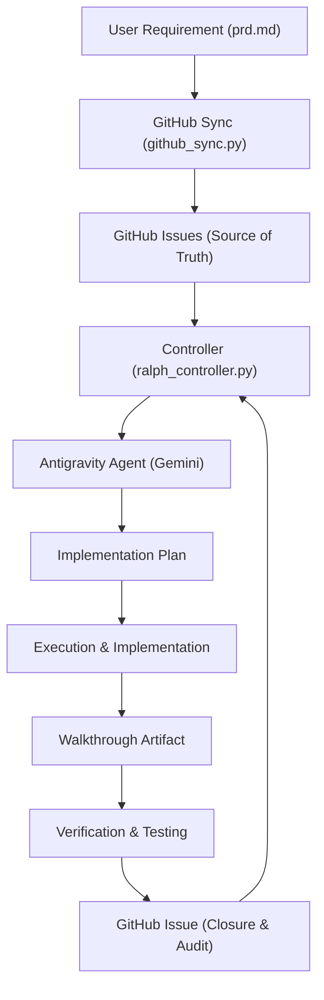
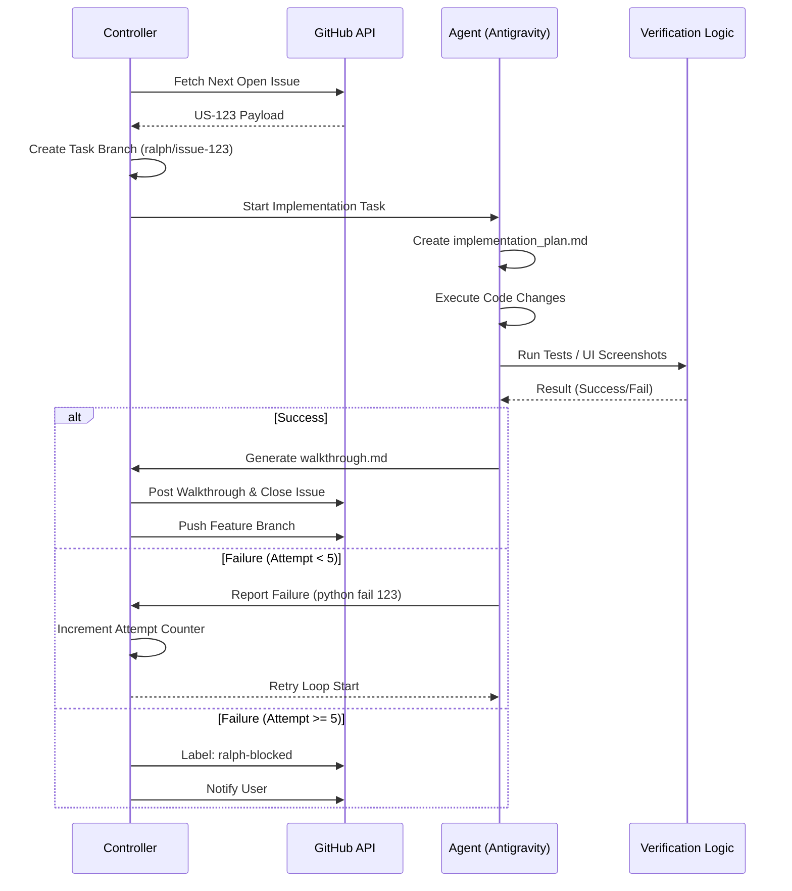
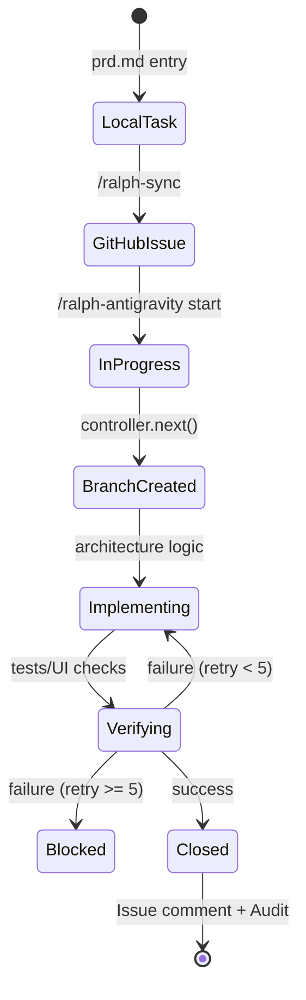

# 🏗️ Ralph-Antigravity System Architecture

This document provides a deep dive into the technical design, data flows, and state management of the Ralph-Antigravity system.

---

## 1. High-Level System Overview
Ralph-Antigravity follows an **Event-Driven Loop** architecture, where the state is distributed between the local file system and GitHub.



---

## 2. The Resilient Execution Flow (Architecture 7.1)
The loop is designed to be atomic and failure-resilient. If a task fails verification, it enters a retry-loop (max 5 attempts) before alerting the user.



---

## 3. Task State Transition
The lifecycle of a requirement from inception to production.



---

## 3. Data & State Management

### A. Local State (`ralph_status.json`)
Tracks the current session status and internal retry counters.
```json
{
  "iterations": 1,
  "current_task": { "id": "123", "branch": "ralph/issue-123" },
  "task_attempts": { "123": 1 }
}
```

### B. Context Anchors (`ARCH.md` / `LEARNINGS.md`)
Used for recursive context gathering. The controller crawls the directory tree upwards to merge rules:
- **Project Root**: Global conventions.
- **App Root**: Backend/Frontend specific rules.
- **Feature Root**: Atomic component rules.

---

## 4. Component Breakdown

| Component | Responsibility | Technical Stack |
| :--- | :--- | :--- |
| **`github_sync.py`** | Parses `prd.md` blocks; Syncs to GitHub Issues. | Python3, `gh` CLI |
| **`ralph_controller.py`** | Manages the task loop, branching, and retries. | Python3, `subprocess` |
| **Antigravity Workflows** | Orchestrates the AI's step-by-step logic. | Markdown-driven LLM instructions |
| **Artifacts** | Planning and post-implementation audit trails. | Markdown (`.md`) |

---

## 5. Evolution of Ralph

- **Architecture 1.0**: Simple local `prd.md` list.
- **Architecture 3.0**: GitHub Issues integration & Monorepo labels.
- **Architecture 4.0**: Context Discovery Scan & Parent Inheritance.
- **Architecture 6.0**: Professional User Stories & Acceptance Criteria.
- **Architecture 7.1**: Resilient Branching & INVEST Task Atomization.

---

*This architecture ensures that Ralph remains focused, verifiable, and safe for enterprise-scale projects.* 🚀
