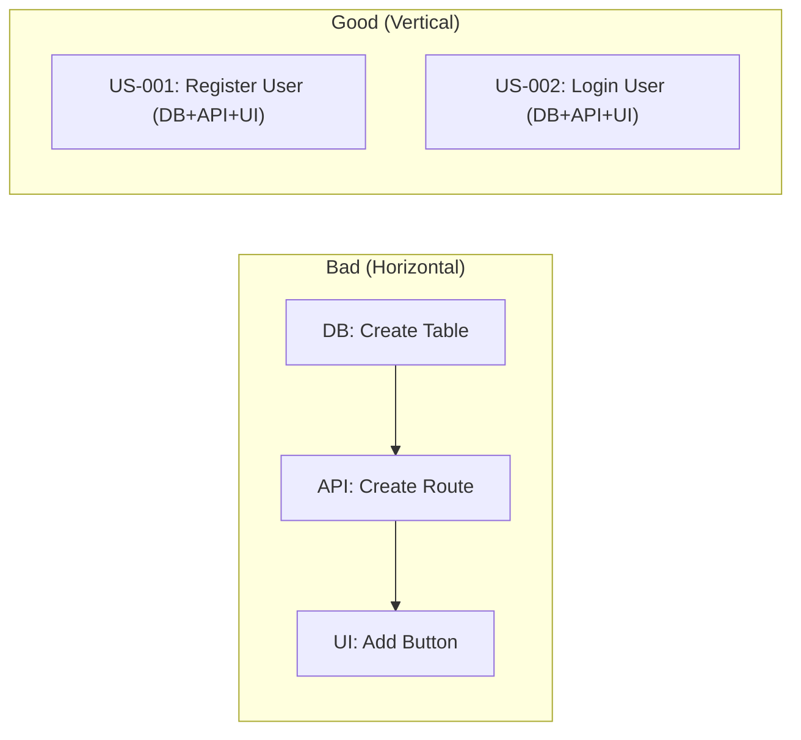

# 🏗️ Managing Complex Projects with Ralph-Antigravity
## A Guide for Junior Developers

So you've graduated from a single-file script to a complex application with multiple modules? Welcome to the big leagues! Ralph-Antigravity is designed to scale with you. This guide explains how to use the **Architecture 6.0** (Detailed Stories) features in real-world multi-app environments.

---

### 1. The Monorepo Structure
In a professional environment, you often have a "Monorepo" (one repository with many applications). 

**Example Project Layout:**
```text
my-cool-app/
├── apps/
│   ├── api/             # Backend (Node/Python)
│   │   └── prd.md       # Backend Tasks (Detailed Format)
│   ├── web/             # Frontend (React/Next.js)
│   │   └── prd.md       # Frontend Tasks (Detailed Format)
├── packages/
│   └── shared-types/    # Shared code between both
└── LEARNINGS.md         # Global project engineering rules
```

### 2. The Detailed PRD Format (Architecture 6.0) 💎
Ralph now expects tasks to be structured as professional **User Stories**. This makes the AI much more accurate because it understands the *why* and the *how* before it starts.

**Example in `apps/api/prd.md`:**
```markdown
### US-001: Create User Login API
**Description:** As a developer, I want a secure login endpoint so that users can authenticate.

**Acceptance Criteria:**
- [ ] POST /api/login endpoint exists
- [ ] Returns JWT on success
- [ ] Returns 401 on invalid credentials
- [ ] Typecheck/lint passes
```

### 3. Scoped Synchronization
You don't want your backend tasks mixed up with your frontend tasks. Ralph handles this automatically.

**How to sync:**
1. Put a `prd.md` in each folder.
2. Run `/ralph-sync`.
3. **The Result**: Ralph creates GitHub Issues but adds a `scope:api` or `scope:web` label automatically based on the folder name. 

### 4. Running a "Targeted" Loop
If you are a Frontend Developer today, you don't want the AI accidentally touching the Backend.

**Command:**
```bash
/ralph-antigravity start --scope web
```
Ralph will now only look for issues labeled `scope:web`. This keeps the AI focused and prevents it from breaking other modules.

### 5. Handling Cross-App Dependencies
Sometimes the Web app needs the API to be finished first. You can communicate this to Ralph using issue numbers.

**In `apps/web/prd.md`:**
```markdown
### US-002: Add Login Screen (requires #12)
**Description:** As a user, I want a login screen so I can access my account.

**Acceptance Criteria:**
- [ ] Login form with Email/Password
- [ ] Calls the login API
- [ ] Redirects to dashboard on success
```
*(Assuming #12 is the "API: Create User Login API" issue)*

### 6. The Artifact Lifecycle (Your Work Diary)
As a Junior Dev, your biggest value is documenting *how* you solved a problem. Ralph makes this mandatory:

1.  **`implementation_plan.md`**: Before writing code, Ralph drafts a plan. Review this! It's your chance to play "Tech Lead" and correct the AI's approach.
2.  **`walkthrough.md`**: Once the task is done, a walkthrough is generated. This is automatically posted to the GitHub Issue.

### 7. Adopting Ralph in an Existing Project 🛫
Don't worry, you don't have to start from zero! You can bring Ralph into a project you've already been working on for months.

#### How to Onboard:
1. **Copy the Files**: Copy the `src/` folder and the `.agent/workflows/` folder into your project.
2. **Run the Onboarder**: Type: `/ralph-onboard`
3. **What I will do**: I'll scan your code for formatting patterns and technical debt (`TODO` comments) to build your first `prd.md`.

### 9. Safety & Resilience (Architecture 7.0) 🛡️
As you give Ralph more autonomy, we need to make sure he doesn't break your `main` branch or spin in an infinite loop.

#### A. Task-Specific Branching
Ralph no longer works on `main`. Every time he starts a task, he creates a temporary branch:
- **Format**: `ralph/issue-[ID]-[Title]`
- **Benefit**: You can review his code in a Pull Request before it ever touches your production code.

#### B. The 5-Attempt Rule
If a task is too hard or tests keep failing, Ralph won't keep trying forever.
- Ralph keeps a counter in `ralph_status.json`.
- **Max Retries**: 5 attempts.
- **Fail-Safe**: After 5 failures, Ralph marks the GitHub issue with `ralph-blocked` and stops to wait for your help.

#### C. Documentation First
Architecture 7.0 adds a mandatory **Documentation Phase**. 
- Ralph is instructed to check your `README.md` and `docs/` folder after every feature.
- **Goal**: No more "I forgot to update the docs" excuses!

---

### 💡 Pro-Tip: The INVEST & Slicing Framework (Architecture 7.1) 🎯
To get the most out of Ralph, your tasks shouldn't just be "detailed"—they should be **INVEST**-compliant.

*   **I (Independent)**: Tasks shouldn't wait for other un-started code.
*   **S (Small)**: If a human takes >1 hour to code it, the task is **Too Big**. Break it down.
*   **Vertical Slicing**: Don't just "Update the Database." Instead, "Add Email field to DB and API." Deliver a full slice of functionality!

### 11. Architecture Decision Records (ADRs) 🏛️
If you make a major change (like switching a database or adding a new library), Ralph will now ask for an **ADR** in the planning phase. 

An ADR explains:
- **Context**: The problem.
- **Decision**: Your solution.
- **Consequences**: The pros and cons.

*Junior Dev Tip*: ADRs are your best friend! They prove to your team *why* you made a choice, so no one can say you just "guessed."

### 10. Visual Feature Slicing 🍰
Here is how you should think about your `prd.md` structure:



Happy Scaling! 🚀
